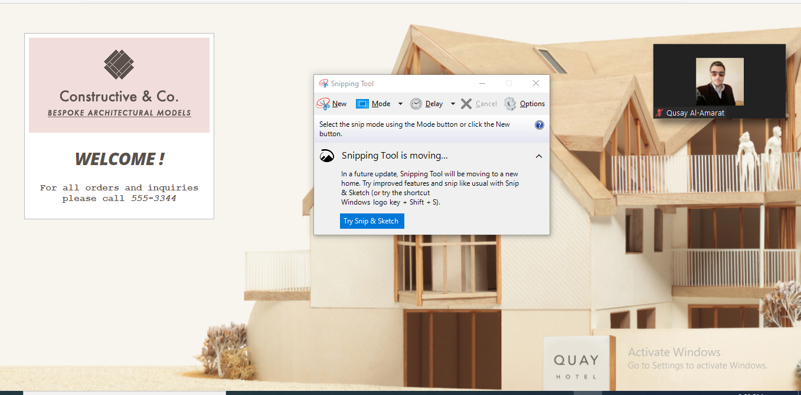

### Today's summary
# The document object represents an html page Like other objects that represent real-world things,

# HOW HTML, CSS, and JAVASCRIPT FIT TOGETHER?
**HTML**:*This is where the content of the page lives. The HTML gives the page structure and addssemantics.*
**CSS**:*The CSS enhances the HTML page with rules that state howthe HTML content is presented(backgrounds,borders, box dimensions, colors, fonts, etc.).*

**Javascript**:*This is where we can change how the page behaves, adding interactivity. We will aim to keep as much of our JavaScript as possible in separate files.*
**STATEMENTS ARE INSTRUCTIONS AND EACH ONE STARTS ON A NEW LINE**:*A statement is an individual instruction that the computer should follow. Each one should start on a new line and end with a semicolon. This makes your code easier to read and follow,The semicolon also tells the JavaScript interpreter when a step is over indicating that it should move to the next step.*
## The document object has:
1. proprties: Properties describe characteristics of the current web page (such as the title of the page).
2. Methods : Methods perform tasks associated with the document currently loaded in the browser (such as getting information from a specified element or adding new content).
**WHAT IS A VARIABLE?**: *A script will have to temporarilystore the bits of information itneeds to do its job. It can store thisdata in variables*
